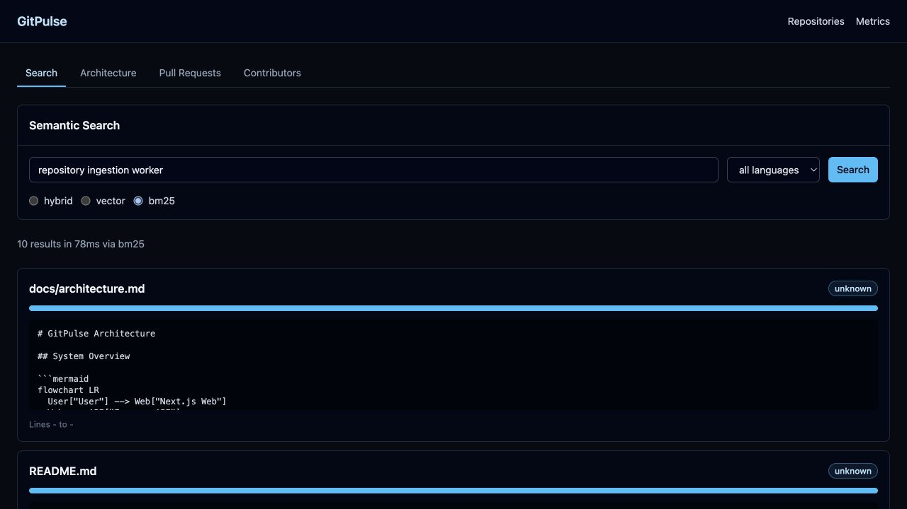
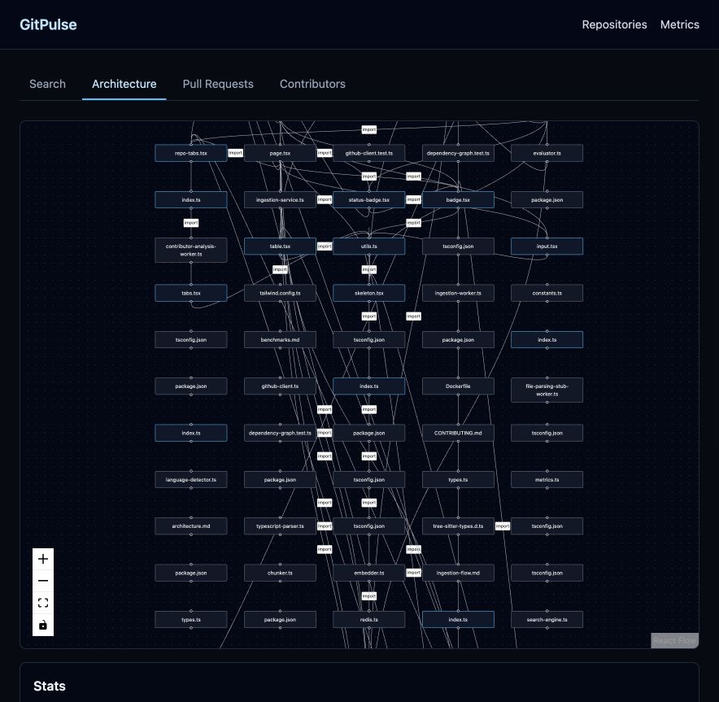
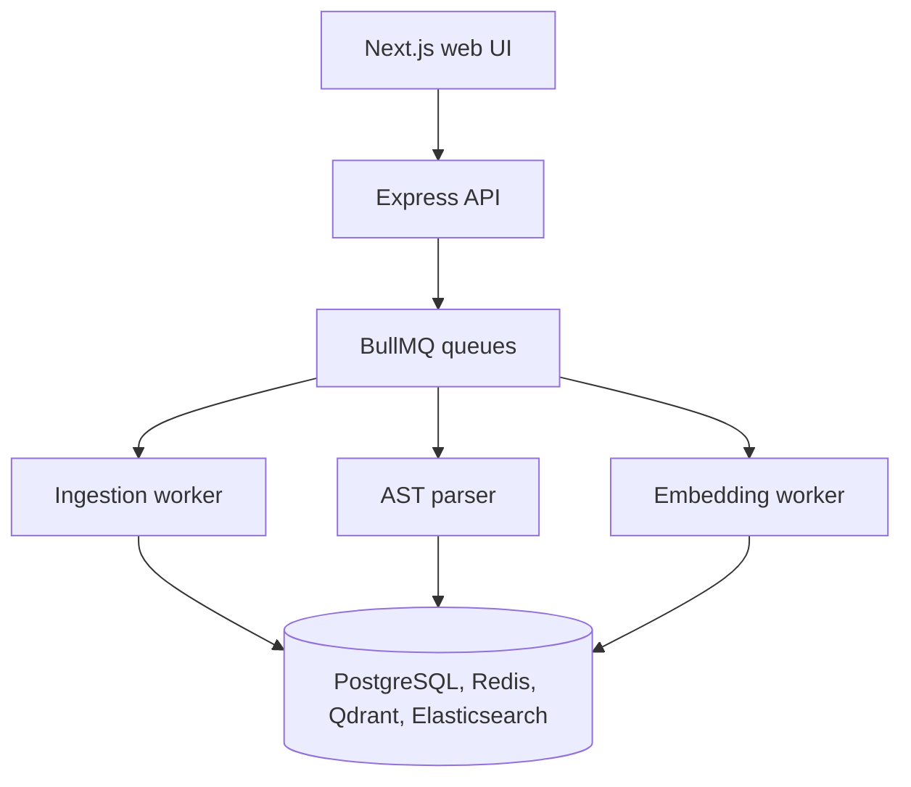

# GitPulse

> Semantic Code Intelligence & Repository Analytics Platform

[](https://typescriptlang.org)
[](https://nodejs.org)
[](https://pnpm.io)
[](LICENSE)
[](https://github.com/DevaanshKathuria/GitPulse/actions/workflows/ci.yml)

GitPulse ingests any GitHub repository and provides semantic code search, AST-powered architecture analysis, PR risk scoring, contributor ownership maps, and engineering analytics through a distributed async pipeline.

## Screenshots

### Semantic code search



The search results come from the Docker Compose stack indexing this repository and executing a real BM25 query.

### Repository architecture



The architecture view renders file-level dependencies with React Flow and summarizes graph health, including edge counts, circular dependencies, and unused files.

---

## What it does

Most developer tools let you *browse* code. GitPulse lets you *understand* it.

Point it at any GitHub repo and it:

- **Finds code by meaning, not keywords.** Ask "where is JWT auth implemented?" and get the exact functions instead of a grep output.
- **Maps your architecture automatically.** Generates a dependency graph of every file, detects circular dependencies, and flags over-coupled modules.
- **Scores every PR for risk.** Analyses diffs to detect breaking changes, changed dependencies, and architectural impact before a PR is merged.
- **Quantifies contributor ownership.** Shows who owns which subsystems, calculates bus factor per directory, and surfaces knowledge concentration risks.

---

## Architecture overview



---

## Tech stack

| Layer | Technology |
|---|---|
| Language | TypeScript 5.7 (strict mode throughout) |
| API | Express.js + Zod validation |
| Queue | BullMQ + Redis |
| Vector DB | Qdrant |
| Keyword search | Elasticsearch 8 (BM25) |
| Database | PostgreSQL 16 + Prisma ORM |
| AST parsing | ts-morph (TypeScript), Tree-sitter (Python, Go) |
| Embeddings | OpenAI text-embedding-3-small |
| Reranking | HuggingFace cross-encoder/ms-marco-MiniLM-L-6-v2 |
| LLM | OpenAI GPT-4o (PR summaries) |
| Cache | Redis (ioredis) with stale-while-revalidate |
| Metrics | Prometheus + prom-client |
| Logging | pino (structured JSON) |
| Frontend | Next.js 14 (App Router) + Tailwind + shadcn/ui |
| Infra | Docker + Docker Compose + Turborepo |
| CI/CD | GitHub Actions |

---

## Core features

### Hybrid semantic code search

Three retrieval strategies available per query:

- **Vector search:** embeds the query with text-embedding-3-small and searches Qdrant by cosine similarity
- **BM25:** runs an Elasticsearch keyword search over all indexed code
- **Hybrid + reranking:** uses Reciprocal Rank Fusion (RRF) to merge both result sets, then reranks the top 20 candidates with a cross-encoder

Chunking is AST-aware: functions and classes become their own chunks, preserving semantic boundaries instead of slicing at arbitrary character limits.

Example query:
```
POST /api/v1/search
{
  "query": "where is rate limiting implemented?",
  "repoId": "clx...",
  "strategy": "hybrid",
  "filters": { "language": "typescript" }
}
```

### AST parsing engine

Every TypeScript, JavaScript, Python, and Go file is parsed after ingestion. Extracted per file:

- All function/class/interface declarations with line ranges
- Import and export statements (internal vs external)
- Express/Next.js API route declarations
- Cross-file call graph edges

Used to power: AST-aware chunking, dependency graph generation, circular dependency detection, dead code detection.

### Architecture intelligence

```
GET /api/v1/repos/:id/architecture
```

Returns a full dependency graph as nodes + edges (react-flow compatible), plus:

- Circular dependency list (DFS cycle detection)
- Over-coupled modules (files with >15 dependents)
- Dead code candidates (exported but never imported internally)
- Module coupling scores

### PR intelligence

```
GET /api/v1/repos/:id/prs/:prId/intelligence
```

For every PR:

- GPT-4o generated summary (3-5 sentences, technically focused)
- Risk score (0-100) based on: files touched, critical paths, dependency changes, test coverage signals, diff size
- Breaking change detection (removed/renamed exported symbols)
- Changed dependency map (added/removed imports)

### Contributor analytics

```
GET /api/v1/repos/:id/bus-factor
```

- File ownership map from the latest 100 commits (a contributor with >50% of changes to a file owns it)
- Bus factor per directory
- Knowledge concentration risk: critical (1 owner), high (2 owners), medium (<=3 owners)
- 12-week activity trend per contributor

### Async ingestion pipeline

Repositories are ingested through a 4-stage queue pipeline:

```
repo-ingestion -> file-parsing -> embedding-generation
                              -> pr-analysis
                              -> contributor-analysis
```

Repository source is downloaded as a single GitHub tarball instead of one API request per file, so public repositories can be indexed without exhausting GitHub's unauthenticated rate limit. A repository remains in `indexing` until every file has completed parsing and search indexing.

All jobs are: idempotent (safe to re-run), retry-safe (3 attempts, exponential backoff), and failure-isolated (one file failing does not block the rest of the repo).

---

## Measured retrieval evaluation

Measured locally on August 13, 2026 after indexing this repository (122 files). The dataset contains 20 manually labeled developer-intent queries and uses exact repository-relative file paths as relevance judgments.

| Strategy | Recall@5 | Recall@10 | MRR | nDCG@10 | Mean latency | p95 latency |
|---|---:|---:|---:|---:|---:|---:|
| BM25 | 35.0% | 55.0% | 0.197 | 0.279 | 21ms | 19ms |
| Vector | **95.0%** | **95.0%** | **0.749** | **0.798** | 631ms | 1034ms |
| Hybrid (RRF) | 75.0% | 90.0% | 0.477 | 0.576 | 642ms | 1143ms |

Pure vector search outperformed hybrid retrieval on this benchmark. The weaker BM25 rankings introduced noise during RRF fusion for these developer-intent queries, so vector search was the strongest strategy for this corpus.

The evaluator clears each query's cached embedding before vector and hybrid searches, so those latency figures include embedding generation. Warm-cache latency was not measured. The BM25 mean exceeds its p95 because one 159ms request raised the mean while the other 19 requests completed in 19ms or less. This is a small project-specific regression benchmark, not a general retrieval claim. The complete methodology, limitations, and per-query results are in [`docs/benchmarks.md`](docs/benchmarks.md).

---

## Project structure

| Path | Purpose |
|---|---|
| `apps/api` | Express REST API and BullMQ workers |
| `apps/web` | Next.js frontend |
| `packages/db` | Prisma schema and database client |
| `packages/queue` | Queue definitions and worker base classes |
| `packages/parser` | AST parsing and dependency graph generation |
| `packages/retrieval` | Chunking, embeddings, and hybrid retrieval |
| `packages/shared` | Shared TypeScript types and constants |
| `tests` | Unit tests for ingestion, parsing, retrieval, and API services |
| `docs` | Architecture, pipeline, benchmark, and design documentation |
| `.github/workflows/ci.yml` | Typecheck, lint, test, and Docker build jobs |

---

## Getting started

### Prerequisites

- Docker + Docker Compose
- Node.js 20 (see [`.nvmrc`](.nvmrc))
- pnpm 9+

No API keys are required to index and BM25-search a public repository. Optional keys unlock additional capabilities:

| Variable | Required for |
|---|---|
| `GITHUB_TOKEN` | Private repositories and full commit/PR/contributor analytics |
| `OPENAI_API_KEY` | Vector embeddings and semantic/vector search |
| `HUGGINGFACE_API_KEY` | Authenticated cross-encoder reranking |

### 1. Clone and install

```bash
git clone https://github.com/DevaanshKathuria/GitPulse.git
cd GitPulse
pnpm install
```

### 2. Configure environment

```bash
cp .env.example .env
# Add optional API keys for the capabilities listed above
```

### 3. Start infrastructure

```bash
docker compose up -d postgres redis qdrant elasticsearch
```

### 4. Run database migrations

```bash
pnpm --filter @gitpulse/db exec prisma migrate dev
```

### 5. Start API and workers

```bash
pnpm dev
```

### 6. Open the UI

Visit [http://localhost:3000](http://localhost:3000), click "Add Repository", and paste any public GitHub URL.

### Fastest path: full Docker stack

```bash
docker compose up -d --build
```

Once the services are healthy, open [http://localhost:3000](http://localhost:3000) and add a public GitHub repository.

---

## API reference

| Method | Endpoint | Description |
|---|---|---|
| POST | `/api/v1/repos` | Add a repository for indexing |
| GET | `/api/v1/repos` | List all repositories |
| GET | `/api/v1/repos/:id` | Repository details + stats |
| POST | `/api/v1/repos/:id/sync` | Trigger incremental sync |
| POST | `/api/v1/search` | Semantic code search |
| GET | `/api/v1/repos/:id/architecture` | Dependency graph + metrics |
| GET | `/api/v1/repos/:id/prs` | PR list with risk scores |
| GET | `/api/v1/repos/:id/prs/:prId/intelligence` | Full PR analysis |
| GET | `/api/v1/repos/:id/contributors` | Contributor analytics |
| GET | `/api/v1/repos/:id/bus-factor` | Bus factor by directory |
| GET | `/metrics` | Prometheus metrics endpoint |
| POST | `/webhooks/github` | GitHub webhook receiver |

---

## Testing and evaluation

Run the unit tests with:

```bash
pnpm test
```

The test suite covers TAR archive parsing, dependency cycle detection, AST-aware chunking, and contributor bus-factor calculations.

### Retrieval evaluation

```bash
# Index a repo first, then run against its repoId
pnpm eval -- --repoId <your-repo-id>
```

Outputs a strategy comparison table and writes results to `docs/benchmarks.md`.

## Observability

Prometheus metrics available at `/metrics`:

- `gitpulse_ingestion_jobs_total`: ingestion job count by status
- `gitpulse_ingestion_duration_seconds`: ingestion duration histogram
- `gitpulse_search_latency_seconds`: search latency by strategy
- `gitpulse_cache_hits_total` / `gitpulse_cache_misses_total`
- `gitpulse_queue_depth`: live queue depth per queue
- `gitpulse_worker_job_duration_seconds`: worker job duration by queue

---

## Documentation

- [Architecture](docs/architecture.md): system design, component responsibilities, and data flow
- [Ingestion flow](docs/ingestion-flow.md): sequence diagram from repository creation to indexing
- [Retrieval pipeline](docs/retrieval-pipeline.md): chunking, RRF fusion, and reranking
- [Benchmarks](docs/benchmarks.md): evaluation methodology and results
- [OpenAPI specification](docs/openapi.yaml): machine-readable HTTP API contract
- [Design decisions](docs/design-decisions.md): engineering tradeoffs and rationale
- [Contributing](CONTRIBUTING.md): local workflow and change guidelines

---

## License

MIT

---
