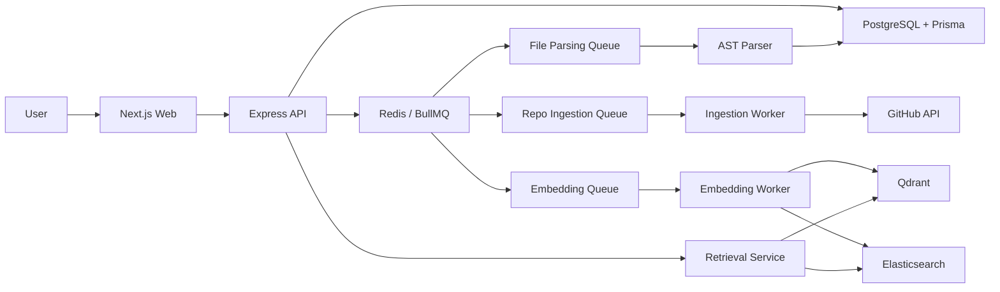

# GitPulse Architecture

## System Overview

## Component Responsibilities

| Component | Responsibility |
|---|---|
| Next.js web | Presents repository, search, architecture, PR, and contributor views by consuming API endpoints. |
| Express API | Owns HTTP routing, validation, cache access, worker startup, metrics, and read/write orchestration. |
| PostgreSQL / Prisma | Stores repositories, commits, PRs, issues, files, AST nodes, dependency edges, chunks, and logs. |
| Redis / BullMQ | Provides queue transport, cache storage, and async job coordination. |
| Ingestion worker | Pulls GitHub repository data and persists normalized records. |
| Parser worker | Converts code files into AST nodes and dependency edges. |
| Embedding worker | Chunks code, generates embeddings, and indexes chunks in Qdrant and Elasticsearch. |
| Retrieval service | Executes vector, BM25, and hybrid searches over indexed code chunks. |

## Data Flow: What Happens When You Add A Repo

1. The web app calls `POST /api/v1/repos` with a GitHub URL.
2. The API validates the URL, creates a `Repository`, creates a pending `IngestionJob`, and enqueues `RepoIngestionJob`.
3. `IngestionWorker` fetches repo metadata, commits, PRs, issues, contributors, and files from GitHub.
4. Code files are upserted into PostgreSQL and each file enqueues a `FileParsingJob`.
5. `ParsingWorker` extracts AST nodes and dependency edges, then enqueues an `EmbeddingJob`.
6. `EmbeddingWorker` chunks and indexes the file into Qdrant and Elasticsearch.
7. The ingestion job marks the repository ready and invalidates affected Redis cache keys.

## Data Flow: What Happens When You Search

1. The web app calls `POST /api/v1/search` with `query`, `repoId`, strategy, and optional filters.
2. The API checks Redis for an identical cached query.
3. On cache miss, `SearchEngine` runs vector, BM25, or hybrid retrieval.
4. Hybrid search merges vector and keyword candidates using Reciprocal Rank Fusion and optionally reranks candidates.
5. Results are logged to `RetrievalLog`, cached in Redis, and returned to the web UI.
