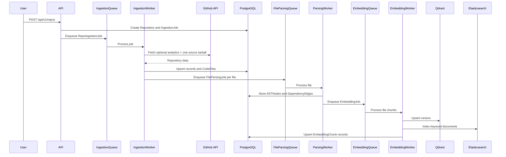

# GitPulse Ingestion Flow

```mermaid
sequenceDiagram
  participant User
  participant API
  participant IngestionQueue
  participant IngestionWorker
  participant GitHubAPI as GitHub API
  participant DB as PostgreSQL
  participant FileParsingQueue
  participant ParsingWorker
  participant EmbeddingQueue
  participant EmbeddingWorker
  participant Qdrant
  participant Elasticsearch

  User->>API: POST /api/v1/repos
  API->>DB: Create Repository and IngestionJob
  API->>IngestionQueue: Enqueue RepoIngestionJob
  IngestionQueue->>IngestionWorker: Process job
  IngestionWorker->>GitHubAPI: Fetch optional analytics + one source tarball
  GitHubAPI-->>IngestionWorker: Repository data
  IngestionWorker->>DB: Upsert records and CodeFiles

  IngestionWorker->>FileParsingQueue: Enqueue FileParsingJob per file
  FileParsingQueue->>ParsingWorker: Process file
  ParsingWorker->>DB: Store ASTNodes and DependencyEdges

  ParsingWorker->>EmbeddingQueue: Enqueue EmbeddingJob
  EmbeddingQueue->>EmbeddingWorker: Process file chunks
  EmbeddingWorker->>Qdrant: Upsert vectors
  EmbeddingWorker->>Elasticsearch: Index keyword documents
  EmbeddingWorker->>DB: Upsert EmbeddingChunk records
```
