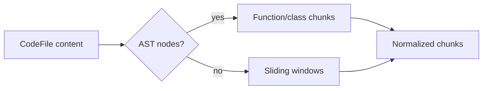

# Retrieval Pipeline

## Chunking Strategy

GitPulse uses AST-aware chunking when parser output exists for a file. Functions and classes become first-class chunks with file path, language, symbol name, and line metadata. Large symbols are split into overlapping windows to preserve context without oversized embedding requests. Unsupported files or files without AST nodes fall back to sliding windows.



## Embedding Generation And Caching

The embedding worker batches chunks in groups of at most 50 and sends them to `text-embedding-3-small`. Embeddings are cached in Redis by content hash for seven days. Cache hits avoid repeated OpenAI calls when the same chunk content appears again.

## Hybrid Fusion

Hybrid search runs vector retrieval and BM25 keyword retrieval, then merges ranked lists using Reciprocal Rank Fusion:

```text
RRF score = sum(1 / (60 + rank_i))
```

This gives useful weight to items that rank well in either retrieval system while rewarding overlap.

## Reranking

The top fused candidates are sent to the HuggingFace cross-encoder reranker. If that request fails, GitPulse falls back to RRF scores so search remains available.

## Cache Layer

Search responses are cached in Redis using a hash of the query, repo, strategy, filters, and `topK`. Repository architecture, contributor, bus factor, and stats endpoints also use Redis with stale-while-revalidate support. Ingestion completion invalidates architecture, contributor, bus factor, and repo stats cache keys.
